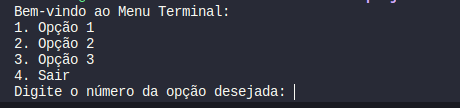

# Entrega-01
Para a entrega:
- Documento detalhando as tecnologias que escolheu para o desenvolvimento de cada
componente que compõe o sistema de automação residencial. Por exemplo, qual tecnologia escolheu para desenvolver o servidor na nuvem, qual tecnologia escolheu para desenvolver
o cliente, qual tecnologia escolheu para desenvolver o dispositivo inteligente, etc.
    - Dependendo das escolhas que fizer, talvez não seja necessário desenvolver o cliente.
- É importante ressaltar como será a comunicação entre cada componente (e.g. como será feita localização, trocas de mensagens, protocolo de comunicação, etc).

## Escolhendo os componentes a serem usados pelo IOT
Para os produtos, a comunicação inicial representada pelo item 1 e 2, é totalmente feita usando o RabbitMQ, da fila de mensagens, onde o servidor estará aguardando conexões, e quando um novo produto se cadastrar, ja que terá dentro de si o dns do docker e a porta do servidor, irá enviar os dados dele através de request e reply.

Exemplo: 
>1. IOT sobe e tenta estabelecer comunicação com o servidor.
>2. Servidor retorna que a conexão ocorreu com sucesso.
>3. IOT envia os dados de divulgação.
>4. Servidor retorna informando que recebeu os dados.
>5. IOT fica ativo aguardando consumo da api.

Para representar o dispositivo, será usado um docker-compose, DockerFile, contendo o arquivo.jar do programa do IOT.
Porém, será passado o diretório dos arquivos do programa de cada dispositivo para iniciar corretamente.
Como os produtos são genéricos, o mesmo código pode usado para representar os 5 produtos, basta mudar o nome e o id deles.

Exemplo descrito no link: [esqueleto](./prodIOT.java)

## Escolhendo o componente a ser usado pelo servidor
O servidor implementa um código em java, contendo duas partes, uma que usa o RabbitMQ, para aguardar conexões de novos produtos, e outra que implementa um código da api de dispositivos IOT.
A api será semelhante a que fizemos em sala da agenda de contato, porém ao inves de contatos, serão produtos IOT, e os dados de cadastro serão providos pela conexão vinda do RabbitMQ.

O servidor ficará hospedado em um docker local, visto que ficamos limitados ao lab 1, e com o docker local, apesar de ser "nuvem", todas as comunicações e acessos vão ocorrer no dns configurado, a porta não foi definida até o momento.
Abaixo está descrito o processo de comunicação do IOT com o Servidor.

Exemplo Servidor e IOT: 
>1. Servidor sobe e aguarda conexões dos IOTs.
>2. IOT tenta estabelecer conexão.
>2. Servidor processa os dados de conexão.
>3. Servidor cadastra o produto.
>4. Servidor retorna informando que recebeu os dados.

Abaixo o processo de comunicação do Cliente com o Servidor.

Exemplo Servidor e Cliente
>1. Servidor sobe e aguarda conexões dos clientes.
>2. Cliente tente estabelecer conexão.
>3. Servidor processa os dados de conexão.
>4. Servidor retorna informando que recebeu a conexão.
>5. Servidor fica aguardando solicitações de consumo de api do cliente

## Escolhendo o componente a ser usado pelo cliente consumidor
O cliente implementa um código e java que se conecta ao servidor e consome dados da api do servidor, tal código usa comunicação padrão de rabbitMQ, o código em java proverá uma interface para o usuário:
sendo ela contida por exemplo:

Sendo assim, para cada escolha do cliente, ele enviará uma determinada solicitação para o servidor, exemplo, cliente seleciona a opção 1, que refere-se a coleta de dados - GET -, e vai listar os produtos que ele tem disponivel, e vai escolher o dispositivo, e quando selecionar um dispositivo, enviará ao servidor a escolha, e o servidor irá processar a solicitação usando a api, e retornará ao cliente a informação desejada.

Porém a lista de dispositos vai ser fornecida para o cliente toda vez que o mesmo selecionar um get, e também fornecendo as funções disponiveis de cada dispositivo.

E a criação do grupo de dispositivos será feita na aplicação do cliente e propagada para o servidor.
Exemplo, o cliente manda criar um grupo, e selecionará quais produtos vão pertencer ao grupo.

E com isso, poderá usar os mesmos métodos que utiliza para coletar com get, adicionar com post, atualizar com put e deletar com delete

Abaixo o processo de comunicação do Cliente com o Servidor.

Exemplo Cliente e Servidor
>1. Cliente sobe e tenta se conectar ao servidor.
>2. Cliente recebe retorno de conexão do servidor.
>3. Cliente processa os dados de conexão.
>4. Cliente envia dados da aplicação para o servidor.
>5. Cliente aguarda retorno da solicitação feita ao servidor.

# Ferramentas a serem usadas
>1. Docker - [Servidor, Dispositivos]
>2. RabbitMQ - [Servidor, Dispositivos, Clientes]
>3. Java - [Servidor, Dispositivos, Clientes]
>4. ApiRest - [Servidor]